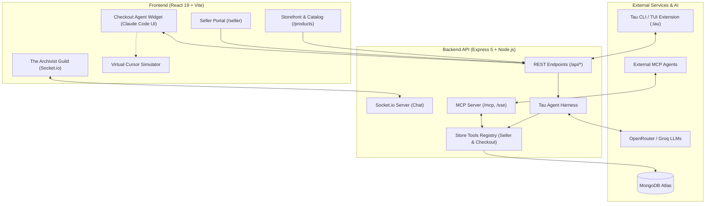

# ARCHIVIST

**ARCHIVIST** is a luxury lifestyle and agentic e-commerce platform crafted for discerning customers who value exceptional craftsmanship in fashion, accessories, and curated design culture. 

Far beyond a conventional storefront, ARCHIVIST merges a curated retail experience with an autonomous AI shopping copilot, an interactive social community layer, an editorial literary journal, and a multi-vendor seller management portal powered by the **Tau Agent Harness** and the **Model Context Protocol (MCP)**.

---

## 🌟 Core Features

### 🛍️ The Storefront & Customer Experience
- **Dynamic Hero Carousel:** Sliding editorial presentation showcasing high-end collections with customizable text overlays and typography.
- **1,200+ Curated Products Across 7 Departments:** Complete catalog spanning Women, Men, Footwear, Bags, Perfumes, Accessories, and Home & Lifestyle.
- **Intelligent Discovery & Ranking Algorithms:**
  - `new_arrivals_algorithm`: Evaluates product recency, freshness score, and stock availability.
  - `bestsellers_algorithm`: Dynamically ranks products based on order velocity, sales volume, and customer rating weightings.
  - `product_search_algorithm`: Multi-field fuzzy search and faceted filtering with instant subcategory mapping.
- **Product Deep Dives:** Split-screen detail pages featuring high-resolution galleries, size and variant selectors, live stock indicators, and craftsmanship storytelling.
- **Customer Wishlist:** One-click item bookmarking with a dedicated personal wishlist board.
- **Reviews & Ratings:** Authenticated customer feedback system with 5-star ratings, aggregate scoring, and verified buyer reviews.
- **Shopping Bag & Cart:** Synchronized persistent shopping bag with instant quantity updates and size variations.
- **Checkout & Discount Engine:** Multi-step checkout with address validation, active discount code redemption, and payment options (Card / COD).
- **Order Tracking ("My Orders"):** Real-time order timeline tracking items across "Pending", "Processed", "Dispatched", and "Delivered" states.
- **Authentication & Security:** JWT-based user and seller authentication with bcrypt password hashing and OTP email verification workflows.

---

### 🤖 Autonomous AI Shopping Assistant & Buyer Copilot (Checkout Agent)
An autonomous, conversational shopping copilot built on the **Tau Agent Harness** (`https://twotimespi.dev/`).

- **Claude Code-Inspired Streaming Interface:**
  - Real-time typewriter token streaming for instant response rendering.
  - Collapsible reasoning blocks (`<thought>`) providing full visibility into the agent's chain-of-thought logic.
  - Live tool telemetry cards highlighting active tool name, domain category, execution state, status badges, and execution latency.
  - Turn tracking with message history, clear history capabilities, and responsive viewport bounding that prevents screen overflow.
- **Multi-Attribute Catalog Copilot (`search_products`):**
  - Natural-language querying with structured filtering by category, subcategory, brand name, exact price bounds (INR), minimum rating, minimum discount percentage, size availability, and sorting criteria (`price_asc`, `price_desc`, `rating_desc`, `newest`, `discount_desc`).
- **Curated Selection Delegation to Catalog:**
  - Findings broadcast seamlessly to the main `/products` catalog, rendering a dedicated **"Copilot Curated Selection"** banner with auto-scroll and quick-inspect controls.
- **Autonomous Visual Actions & Virtual Cursor:**
  - Capable of triggering simulated visual UI actions across the storefront:
    - `ui_navigate`: Direct client-side route transitions.
    - `ui_search`: Types queries directly into the search bar.
    - `ui_click_product`: Selects and opens product detail pages.
    - `ui_select_size`: Automatically selects sizes on the product page.
    - `ui_add_to_cart`: Places items directly into the user's shopping bag.
    - `ui_checkout`: Advances the user to the checkout screen.
  - Visualized on screen via an animated **Virtual Cursor** simulation.

---

### 🧑‍💼 Lucas: AI Business Operations Assistant (Seller Agent)
An integrated business operations agent tailored for authenticated multi-vendor sellers, powered by the **Tau Agent Harness**.

- **Reliable Direct Tool Execution:** Eliminates HTTP-over-SSE loop deadlocks through direct execution within isolated error boundaries.
- **Conversational Compaction:** Automatically compacts long operational transcripts to fit context windows without losing context.
- **Store Operations Toolset:**
  - `getSellerOverview`: High-level business performance, revenue, and active catalog summary.
  - `searchProducts`: Natural-language search across the seller's catalog.
  - `getInventory`: Stock status tracking filtered by `ALL`, `LOW`, or `OUT` of stock.
  - `getOrders`: Live order status, customer delivery addresses, and fulfillment tracking.
  - `getRevenue`: Financial metrics, gross sales, and average order value (AOV) calculated from real order transactions.
  - `getCustomers`: Customer CRM insights and buyer relationship tracking.
  - `getCommunities`: Operational insights across brand engagement in Guild circles.

---

### 💼 Multi-Vendor Seller Portal
A backend management suite empowering independent designers and merchants:

- **Seller Dashboard:** Metric overview displaying total revenue, active orders, customer count, and low-stock alerts.
- **Product Management:** Full CRUD operations for creating, updating, and removing products with multi-image URLs, variant specifications, subcategories, and stock tracking.
- **Order Fulfillment:** Live order pipeline allowing sellers to inspect shipping details and advance orders through fulfillment stages ("Processed", "Dispatched", "Delivered").
- **Customer CRM:** Aggregated directory of unique customers who have purchased from the seller, tracking total spend and order frequency.
- **Seller Analytics:** Financial charts, gross revenue tracking, average order value (AOV), and promotional discount ROI.
- **Payouts Ledger:** Financial reconciliation interface tracking pending vs. processed platform-to-seller payouts.
- **Discount Management:** Create, configure, and toggle targeted coupon codes with minimum purchase requirements and percentage discounts.
- **Seller Reviews:** Centralized review dashboard to monitor ratings and customer sentiment.

---

### 🏛️ The Archivist Guild (Social Layer & Real-Time Communities)
An interactive community layer for design and fashion connoisseurs:

- **Curated Circles:** Join style communities such as *Streetwear*, *Western Dresses*, *Minimalistic Lovers*, and *Classical Indian*.
- **Real-Time Group Chat:** Powered by **Socket.io** with authenticated socket sessions.
- **Community Management:** Create new circles, monitor member counts, and synchronize memberships automatically via backend scripts.

---

### 📖 Editorial Journal (Archives)
A literary journal presenting cultural essays, trend forecasts, and artisan spotlights:

- **Literary Review Aesthetic:** Editorial typography with themed volumes and long-form cultural essays (e.g., *"Silk's Aura"*, *"Monochrome Matters"*).
- **Thematic Archive Volumes:** Grouped journal volumes with search and filtering.
- **Trending Algorithm:** Backed by `trending_blogs_algorithm` weighting view velocity, engagement, and publication recency.

---

### 🔌 Model Context Protocol (MCP) Server
ARCHIVIST includes an integrated Model Context Protocol (MCP) server adhering to the official specification:

- **Streamable HTTP Transport:** Modern protocol version `2025-11-25` via `/mcp`.
- **HTTP + SSE Transport:** Backward-compatible protocol version `2024-11-05` via `/sse` and `/messages`.
- **External Agent Interoperability:** Allows external AI agents (Claude Desktop, Cursor, external Tau CLI sessions) to query products, inspect catalog data, and review store status.

---

### 🐍 Official Tau Agent Extension (`.tau/extensions/archivist.py`)
ARCHIVIST provides a native Python extension for the **Tau Agent Framework** (`https://twotimespi.dev/guides/extensions/`):
- Connects official Tau CLI and TUI sessions directly to the ARCHIVIST backend API.
- Registers native tools: `archivist_search_products` and `archivist_store_status`.
- Automatically injects ARCHIVIST project context, currency definitions, and architectural guidelines into Tau agent sessions.

---

## 💻 Technology Stack

| Layer | Technologies |
|---|---|
| **Frontend** | React 19, Vite 7, Tailwind CSS 4, React Router 7, Axios, Socket.io-client, Lucide Icons |
| **Backend** | Node.js (ES Modules), Express 5, MongoDB & Mongoose 9, Socket.io, Nodemailer, Cookie-Parser, CORS |
| **Agent & AI Layer** | **Tau Agent Harness** (`TauProvider`, `TauHarness`, `TauSession`, `TauTranscript`, `ToolRegistry`), OpenRouter API / Groq API |
| **MCP Integration** | `@modelcontextprotocol/sdk` (Streamable HTTP & SSE Transports) |
| **Testing & Tools** | Puppeteer (E2E UI Testing), Axios (API Route Testing), Custom Tau Harness Validation Suite, Nodemon |

---

## 📐 System Architecture



---

## 🚀 Getting Started

### Prerequisites
- **Node.js** (v18.0.0 or higher recommended)
- **npm** (v9.0.0 or higher)
- **MongoDB** (Local instance or MongoDB Atlas cluster URI)
- **LLM API Key** (OpenRouter API Key or Groq API Key for agent features)

---

### Installation

1. **Clone the repository:**
   ```bash
   git clone <repository-url>
   cd Practice1
   ```

2. **Install Backend Dependencies:**
   ```bash
   cd Backend
   npm install
   ```

3. **Install Frontend Dependencies:**
   ```bash
   cd ../Frontend
   npm install
   ```

---

### Environment Configuration

Create a `.env` file inside the `Backend` directory:

```env
# Server Configuration
PORT=5000
FRONTEND_URL=http://localhost:5173

# Database Connection
MONGODB_URI=your_mongodb_connection_string

# Authentication Secrets
JWT_ACCESS_SECRET=your_jwt_access_secret_key
JWT_REFRESH_SECRET=your_jwt_refresh_secret_key

# Email Service (OTP Verification)
EMAIL=your_email@gmail.com
EMAIL_PASS=your_email_app_password

# LLM Providers for Tau Agent Harness (Checkout Agent & Lucas)
# Option A: OpenRouter (Recommended)
OPENROUTER_API_KEY=your_openrouter_api_key
OPENROUTER_MODEL=nvidia/nemotron-3-ultra-550b-a55b:free

# Option B: Groq (Alternative)
GROQ_API_KEY=your_groq_api_key
```

*(Optional Frontend `.env` in `Frontend/`)*:
```env
VITE_API_URL=http://localhost:5000
```

---

### Database Seeding & Data Population

To populate the database with complete catalog items, journal entries, and community circles:

```bash
cd Backend

# 1. Seed base product catalog
npm run seed:products

# 2. Import complete Excel catalog dataset (1,200+ products across 7 categories)
node scripts/importExcelProducts.js

# 3. Seed editorial journal essays and archives
node scripts/seedBlogs.js

# 4. Synchronize community circle memberships
node scripts/syncCommunityMemberships.js
```

---

### Running the Application

**1. Start the Backend API Server:**
```bash
cd Backend
npm run dev
```
*Backend runs on `http://localhost:5000`*

**2. Start the Frontend Development Server:**
```bash
cd Frontend
npm run dev
```
*Frontend runs on `http://localhost:5173`*

---

## 🧪 Testing Suite

ARCHIVIST features a comprehensive test suite across agent mechanics, backend APIs, and frontend routes:

### 1. Tau Agent Harness Test
Verifies Tau event lifecycles, tool error isolation boundaries, orphaned tool transcript healing, and tool registries:
```bash
cd Backend
node scripts/testTauHarness.js
```

### 2. Backend API Integration Test
Validates REST endpoints, authentication barriers, and status codes:
```bash
cd Backend
node test-api-routes.js
```

### 3. Frontend UI Puppeteer E2E Test
Runs a headless browser to verify all static and dynamic React application routes:
```bash
cd Frontend
node test-ui-routes.js
```

---

## 🔌 Connecting External Agents via MCP & Tau

### Connecting Claude Desktop or Cursor to ARCHIVIST MCP Server
Add the ARCHIVIST MCP endpoint to your `claude_desktop_config.json`:
```json
{
  "mcpServers": {
    "archivist": {
      "url": "http://localhost:5000/sse"
    }
  }
}
```

### Running the Tau CLI Extension
If you have the official Tau CLI installed (`pip install tau-agent`):
```bash
tau --extension .tau/extensions/archivist.py
```
This enables native commands like searching the ARCHIVIST luxury catalog and verifying backend store status directly within your terminal.

---

## 🎨 Design Philosophy

ARCHIVIST is built on a philosophy of quiet luxury and intentional design:
- **Restrained Palette:** Deep charcoal/stone tones (`stone-950`), alabaster neutrals, and glassmorphic translucent surfaces.
- **Editorial Typography:** Harmonious pairings of clean sans-serif geometric fonts and high-fashion display typefaces.
- **Micro-Interactions:** Subtle hover states, smooth transitions, typewriter streaming, and non-intrusive collapsible inspect panels.
- **Agentic Harmony:** AI assistants blend naturally into the user workflow rather than feeling like disjointed chatbots.

---

## 📄 License

This project is licensed under the MIT License.
